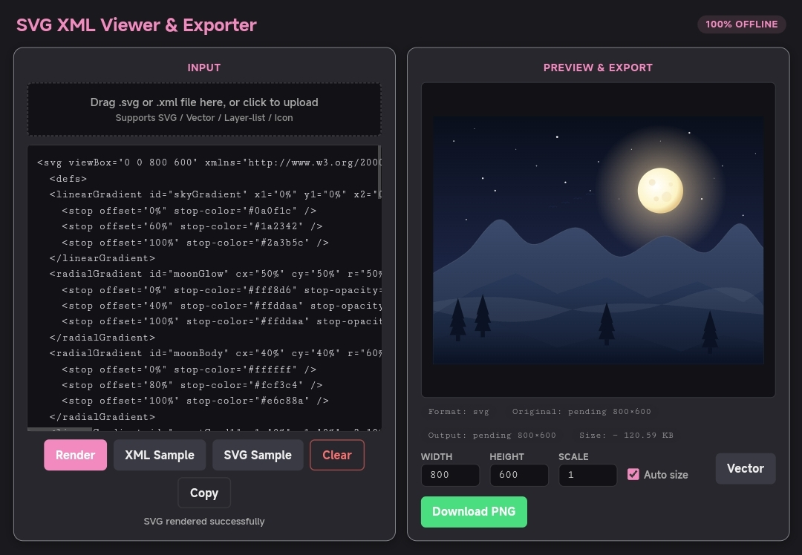
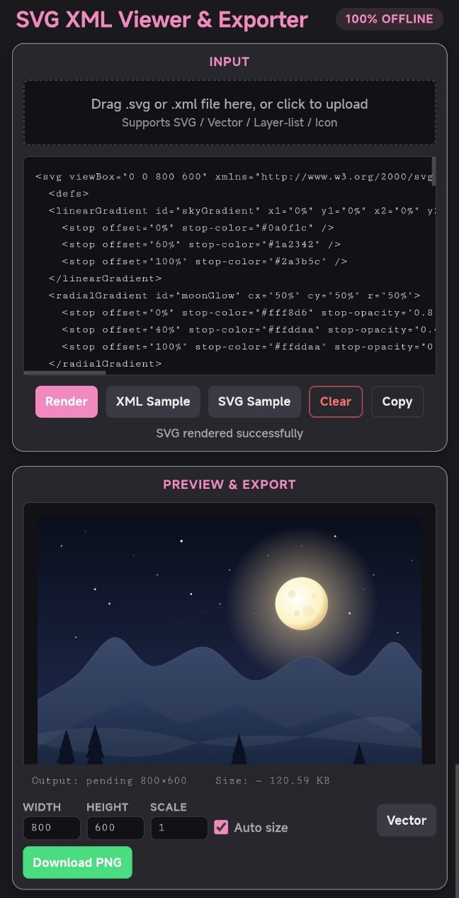

# SVG XML 查看导出工具 · SVG XML Viewer & Exporter

  

一款 100% 离线的 Web 工具，用于预览、转换和导出 Android Vector / Layer-list / Icon 以及标准 SVG 图形。支持拖拽上传、实时渲染、尺寸调节和 PNG 导出，无需任何后端依赖。

A 100% offline web tool for previewing, converting and exporting Android Vector, Layer-list, Icon and standard SVG graphics. Supports drag‑and‑drop upload, real‑time rendering, size adjustment and PNG export – no backend required.

---

## ✨ 功能特性 · Features

- **多格式支持** · **Multi‑format support**  
  识别并渲染：标准 SVG、Android Vector（`<vector>`）、Layer-list（`<layer-list>`）、Icon（`<icon>`）格式。  
  Recognizes and renders: standard SVG, Android Vector (`<vector>`), Layer-list (`<layer-list>`), and Icon (`<icon>`).

- **交互方式灵活** · **Flexible input**  
  - 拖拽或点击上传 `.svg` / `.xml` 文件  
  - 直接粘贴代码到文本框  
  - 提供 XML（Vector）和 SVG 示例，一键加载  
  - Drag‑and‑drop or click to upload `.svg` / `.xml` files  
  - Paste code directly into the text area  
  - One‑click sample loading for XML (Vector) and SVG

- **实时渲染与预览** · **Real‑time rendering & preview**  
  点击“渲染”或按 `Ctrl+Enter`（Mac `Cmd+Enter`）即可生成矢量预览图。  
  Click “Render” or press `Ctrl+Enter` (`Cmd+Enter` on Mac) to generate a vector preview.

- **导出功能** · **Export options**  
  - **下载 PNG**：按设定尺寸和倍率导出高清 PNG 图片  
  - **矢量模式**：切换为直接显示 SVG 矢量图形（适合缩放查看）  
  - **Download PNG** – export high‑quality PNG at custom size and scale  
  - **Vector mode** – display the raw SVG for zoom‑friendly viewing

- **尺寸控制** · **Size control**  
  独立设置宽度、高度和缩放倍率，支持“自动尺寸”根据原始 viewport 自动填充。  
  Independently set width, height and scale factor, with an “Auto size” option that reads the original viewport.

- **错误提示与警告** · **Error & warning feedback**  
  解析错误会显示在预览区，同时收集格式兼容性警告（如缺失渐变颜色、无效 clip‑path 等），并以列表展示。  
  Parse errors appear in the preview area, while compatibility warnings (e.g., missing gradient colours, invalid clip‑path) are collected and shown in a collapsible list.

- **多语言界面** · **Multi‑language UI**  
  根据浏览器语言自动切换中文/英文（支持 `zh` / `en`）。  
  Automatically switches between Chinese and English based on browser language (supports `zh` / `en`).

---

## 🚀 快速开始 · Getting Started

### 在线使用 · Online
直接打开 `html` 文件即可，所有逻辑在单页面内完成，无需网络。  
Just open `html` in your browser – everything runs locally, no internet needed.

### 使用步骤 · How to use
1. **输入代码** · **Input code**  
   - 粘贴 SVG / Vector / Layer-list / Icon 代码到文本区  
   - 或拖拽/点击上传文件  
   - Paste SVG / Vector / Layer-list / Icon code into the text area, or drag‑and‑drop / click to upload a file.

2. **调整参数** · **Adjust parameters**  
   - 宽度/高度：输出尺寸基准  
   - 倍率：最终 PNG 为 `宽度×倍率 × 高度×倍率`  
   - 自动尺寸：勾选后自动从源数据读取 viewport  
   - Width/Height: base output size  
   - Scale: final PNG will be `width×scale × height×scale`  
   - Auto size: when checked, reads viewport from source data automatically

3. **渲染** · **Render**  
   点击“渲染”或按快捷键 `Ctrl+Enter`  
   Click “Render” or press `Ctrl+Enter`

4. **导出** · **Export**  
   - 点击“下载 PNG”保存图片  
   - 切换“矢量”模式以原始 SVG 方式预览（无像素化）  
   - Click “Download PNG” to save the image  
   - Switch to “Vector” mode to preview as raw SVG (no pixelation)

---

## 🧩 支持格式说明 · Supported Formats

| 格式 Format | 根标签 Root tag | 关键属性 Key attributes | 输出 Output |
|-------------|----------------|-------------------------|-------------|
| SVG | `<svg>` | `viewBox` / `width` / `height` | 直接渲染 Direct rendering |
| Android Vector | `<vector>` | `viewportWidth` / `viewportHeight`，`<path>` 等 | 转换为 SVG Convert to SVG |
| Layer-list | `<layer-list>` | `<item>` 内 `<shape>` / `<gradient>` | 转换为 SVG Convert to SVG |
| Android Icon | `<icon>` | `width` / `height`，`<layer>` / `<path>` 等 | 转换为 SVG Convert to SVG |

> 注意：部分 Android 特有属性（如 `android:` 命名空间）会被自动解析。  
> Note: Android‑specific attributes (e.g., `android:` namespace) are automatically handled.

---

## 🛠 技术栈 · Tech Stack

- 纯原生 HTML + CSS + JavaScript（ES6）  
- 使用 `DOMParser` 解析 XML，`Canvas` 生成 PNG  
- 内置颜色解析器（支持十六进制、RGB/RGBA、HSL/HSLA、Android 颜色引用等）  
- 无第三方库，完全离线  

- Pure vanilla HTML + CSS + JavaScript (ES6)  
- Uses `DOMParser` for XML parsing and `Canvas` for PNG generation  
- Built‑in colour parser (supports hex, RGB/RGBA, HSL/HSLA, Android colour references, etc.)  
- No third‑party libraries, fully offline

---

## 缺点 · drawback

- 极致压缩版本是由AI做的
- 移动端界面可能不是那么适配
- 翻译可能不是很好
- 本人可能以后不在维护，因为目前的功能已经满足我的需求
- 
- Lite_version was made by AI.
- It may not be very mobile-friendly.
- This translation may not be perfect.
- I may not maintain it in the future, since the current features already meet my needs.

## 📄 许可 · License

本项目仅作为个人工具使用，可自由修改和分发，哪怕说是你自己写的都行。  
This project is for personal use only. You are free to modify and distribute it, and you may even claim it as your own work.

---

**Made with ❤️ for SVG/Vector developers**
